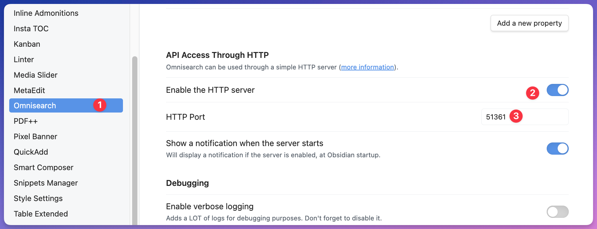

# Alfred Obsidian Search Workflow

An Alfred Workflow for quick searching, previewing, and opening Obsidian notes.

## Features

- 🔍 Multi-vault search support
- 📝 Real-time Markdown preview
- 📊 Math formula rendering
- 🎨 Beautiful search results display
- ⚡ Fast response


## Requirements

- [Alfred 4+](https://www.alfredapp.com/)
- [Obsidian](https://obsidian.md/)
    - You must install the OmniSearch plugin, and open its HTTP server
    
- Python packages
    - you have to install the following packages in your python environment
        ```bash
        pip install requests aiohttp aiofiles
        ```

## Installation

1. Download the latest `.alfredworkflow` file
2. Double-click to install in Alfred
3. Configure Obsidian search ports in Alfred preferences
4. Ensure Obsidian search service is running

## Usage

1. Press `⌥ + Space` to open Alfred
2. Type `obs` to trigger search
3. Enter search keywords
4. Use `⌘ + L` to preview search results
5. Press `Enter` to open file in Obsidian

## Configuration

### Environment Variables

- `alfred_workflow_cache`: Alfred workflow cache directory
- `query_ports`: Obsidian search service ports, comma-separated for multiple ports

### Search Service

Ensure Obsidian search service is running on:
- Default port: `27123`
- Configurable for multiple ports

## Technical Implementation

- Python for search request handling
- Marked.js for Markdown rendering
- MathJax for math formula rendering
- Mermaid.js for diagram rendering
- Local JavaScript library caching for performance

## Troubleshooting

### No Search Results
- Check if Obsidian search service is running
- Verify port configuration
- Validate vault paths

### Preview Not Displaying
- Check network connection
- Verify JavaScript libraries are downloaded correctly
- Check Alfred workflow logs

## Changelog

### v1.0.0
- Initial release
- Basic search functionality
- Markdown preview support

